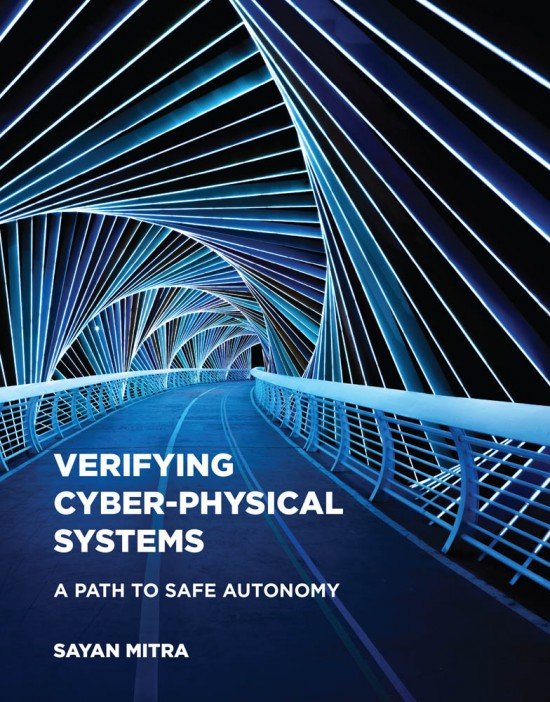

This web page contains additional supporting material for the book 
**Verifying Cyber-physical Systems** written by 
[Sayan Mitra][sayan-homepage] and published by [MIT press][mit-press-homepage], in February 2021. This book  presents a unified mathematical framework for modeling and analyzing cyber-physical systems, with a strong focus on verification.
The book available from [Amazon][amazon-bookpage], [Barnes and Noble][bn-page], and [Penguin][pr-page].




**Endorsements**

“Mitra’s book provides a thoroughly modern view of the techniques for specification and verification of cyber-physical systems, expertly explaining how tools from control theory, dynamical systems, automata theory, and formal methods can be combined to analyze safety in autonomous systems. Using a combination of conceptual examples that can be used to understand basic concepts and modern applications that motivate the need for new approaches, this book provides the foundation for practitioners interested in understanding conceptual frameworks for verification of hybrid systems and researchers interested in establishing a rigorous basis for further advances.”

<h5>Richard Murray, Thomas E. and Doris Everhart Professor of Control and Dynamical Systems and Bioengineering, Caltech</h5>

<br>

“This is an excellent textbook that gives a comprehensive introduction to state-of-the-art techniques in formal modeling and verification of cyber-physical systems. Its seamless integration of technical details and illustrative examples makes it ideally suited for graduate students hoping to understand this complex subject matter.”

<h5>Rajeev Alur, Zisman Family Professor in the Department of Computer and Information Science, University of Pennsylvania</h5>

<br>

These pages contain lecture slides in editable powerpont format as well as pdf, extra problems, and code for demonstrations and programming assingments.

Learn more, read the book.

**Cite as**
```
@book{MitraCPSBook2021,
	author = {Sayan Mitra},
	title = {Verifying Cyber-Physical Systems: A Path to Safe Autonomy},
	date = {February 16, 2021},
	publisher = {MIT Press},
	isbn = {978-0-262-04480-6},
	pagetotal = {312},
	url = {https://mitpress.mit.edu/contributors/sayan-mitra}
}
```

**Contact**
- Email: mitras at illinois dot edu
- Twitter: @Mitrasayn

[sayan-homepage]:http://mitras.ece.illinois.edu/
[mit-press-homepage]:https://mitpress.mit.edu/books/verifying-cyber-physical-systems
[amazon-bookpage]:https://tinyurl.com/cpsbookmitra
[bn-page]:https://www.barnesandnoble.com/w/verifying-cyber-physical-systems-sayan-mitra/1137077478?ean=9780262044806
[pr-page]:https://www.penguinrandomhouse.com/books/669466/verifying-cyber-physical-systems-by-sayan-mitra/9780262044806/


